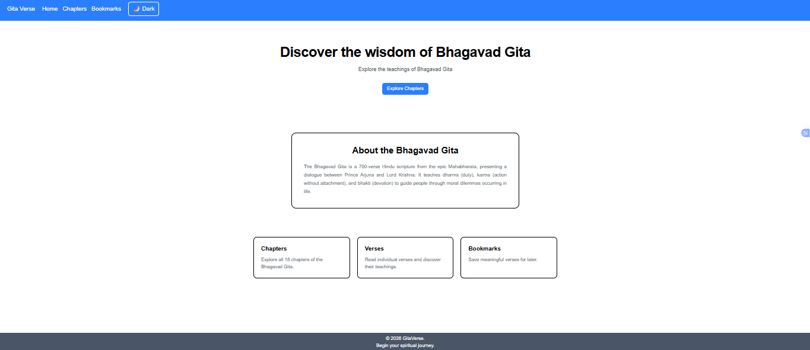

# GitaVerse

A responsive Bhagavad Gita web application built with Next.js, TypeScript, and Tailwind CSS. Users can explore chapters, read verses, bookmark meaningful verses, and switch between light and dark themes.

## Features

-  Browse all 18 chapters of the Bhagavad Gita
-  Read individual verses with Sanskrit text and English translations
-  Bookmark meaningful verses
-  Persist bookmarks using localStorage
-  Remove bookmarked verses
-  Light/Dark theme
-  Responsive and clean UI
-  Navigate between verse ranges

## Technologies Used

- Next.js
- TypeScript
- React
- Tailwind CSS
- Vedic Scriptures Bhagavad Gita API
- LocalStorage

## Installation

```bash
git clone YOUR_GITHUB_REPOSITORY_URL
cd gita-verse
npm install
npm run dev

```
## **Screenshot**



## Live Demo

https://gita-verse-nine.vercel.app/

## Data Source

Verse and chapter data is retrieved from the Vedic Scriptures Bhagavad Gita API.

This is an independent project and is not affiliated with or endorsed by the API maintainers.
